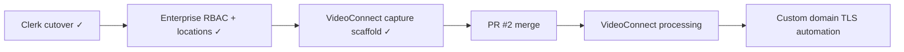

# BidIntelligenceOS — Phase 5 Roadmap

Deferred work extracted from [`PRODUCT_CONTRACT.md`](./PRODUCT_CONTRACT.md) and production alignment notes. Phase 4 (ops APIs, org profile partial enterprise fields, human-review export gates) is live on the team URL; this doc tracks what remains.

**Last updated:** 2026-07-09  
**Baseline:** `main` (Phase 5 enterprise RBAC, multi-location rollups, custom domain field, VideoConnect capture scaffold, platform feed stubs)  
**Team URL:** [https://bidintelligence.cagteam.net](https://bidintelligence.cagteam.net)

## Related docs

| Doc | Purpose |
|-----|---------|
| [`PRODUCT_CONTRACT.md`](./PRODUCT_CONTRACT.md) | Live vs demo module map; Phase 5 table |
| [`ROSE_GITHUB_MAIN_ALIGNMENT.md`](./ROSE_GITHUB_MAIN_ALIGNMENT.md) | GitHub `main` alignment record; Audit-Risk-Model PR #2 status; Carmen checklist |
| [`deploy/RUNBOOK.md`](../deploy/RUNBOOK.md) § **Post-deploy smoke** | `./deploy/deploy.sh` runs `scripts/smoke-team-url.mjs` when `BIOS_SMOKE_PASSWORD` is set |
| [`deploy/RUNBOOK.md`](../deploy/RUNBOOK.md) § **Custom domain cutover** | DNS CNAME + manual TLS (Carmen) |
| [`deploy/RUNBOOK.md`](../deploy/RUNBOOK.md) § **Clerk cutover checklist** | Clerk production cutover for `bidintelligence.cagteam.net` (**complete**) |

---

## Shipped in Phase 5 (2026-07)

| Item | Status | Notes |
|------|--------|-------|
| Clerk production cutover | **live** | `AUTH_ENABLED=true` on team URL; Sign in/up at `/login` |
| Full client export PDF/DOCX | **live** | Server-side generation after human review (`POST /api/v1/bids/:id/export`) |
| RBAC & invites | **partial live** | Invites + member list + permission matrix UI + `PATCH /api/v1/org/members/:userId/role` |
| White label | **partial live** | Branding fields + `customDomain` persist; DNS instructions in UI; TLS manual per RUNBOOK |
| Multi-location | **partial live** | `locations[]` with `parentRegion`, `isPrimary`; regional KPIs on analytics + business profile |
| VoiceConnect | **partial live** | Status + capture list via `VOICE_CONNECT_API_URL` |
| VideoConnect | **partial live** | Status + walkthrough list; VideoConnect API capture form + JSON persistence |
| Platform feed stubs | **partial live** | SAM.gov / BLS / Zoho env-gated status routes + honest UI banners |
| Briefing archive | **live** | `GET/POST /api/v1/briefings/archive` for authed users |
| Post-deploy smoke | **live** | Clerk-aware checks in `scripts/smoke-team-url.mjs` |

---

## Deferred items

### 1. Enterprise — custom domain TLS automation

**Source:** [`PRODUCT_CONTRACT.md`](./PRODUCT_CONTRACT.md); [`deploy/RUNBOOK.md`](../deploy/RUNBOOK.md) § Custom domain cutover.

| Surface | Current | Remaining |
|---------|---------|-----------|
| Custom domain field | **partial live** | Hostname saved on org profile; CNAME instructions in Settings |
| TLS / nginx / Clerk origins | **deferred** | Manual cutover by Carmen; no cert automation |

**Acceptance:** Customer CNAME verified; TLS live on custom hostname; auth redirects work on custom domain.

---

### 2. VideoConnect full capture pipeline

**Source:** [`PRODUCT_CONTRACT.md`](./PRODUCT_CONTRACT.md) — Add-ons; `/video-connect` is **partial live**.

| Current | Phase 5+ target |
|---------|-----------------|
| **partial live** — capture form, JSON persistence, multipart/JSON `POST /api/walkthroughs` | Video processing, visual intelligence, walkthrough-to-bid draft linked to bid intake and Package Builder |

**Route:** `/video-connect`, VideoConnect `/capture`

**Acceptance:** Signed-in users record/upload site walkthroughs; detections feed ROSEOS scope analysis; demo fixtures remain for anonymous sessions only.

---

### 3. Platform feeds — live SAM.gov / BLS / Zoho sync

| Current | Target |
|---------|--------|
| **partial live** — env vars + `GET /api/v1/integrations/{sam-gov,bls,zoho}/status` | Wire live API pulls when keys configured |

---

### 4. Audit-Risk-Model PR #2 merge

**Source:** [`ROSE_GITHUB_MAIN_ALIGNMENT.md`](./ROSE_GITHUB_MAIN_ALIGNMENT.md) § Appendix — Audit-Risk-Model integration & merge status.

| Field | Value |
|-------|-------|
| PR | [#2 — feat: safe scoring-engine alignment (phase 1)](https://github.com/contractorcomplianceco-cmyk/Audit-Risk-Model/pull/2) |
| State | **OPEN** — awaiting Rose sign-off |
| Remote branch | `feat/safe-alignment-phase1` (tip `9e45521`) |
| CI | Green; mergeable |

**Blocker:** Do not merge without explicit Rose approval.

---

## Suggested sequencing

1. **Clerk cutover** — **complete** (2026-07).
2. **Enterprise RBAC, locations, custom domain field** — **partial live** (2026-07).
3. **VideoConnect capture scaffold** — **partial live** (2026-07).
4. **Audit-Risk-Model PR #2** — awaiting Rose.
5. **VideoConnect processing + platform live feeds + TLS automation** — next slices.

---

## Out of scope (Phase 5)

- BuildConnect, ComplianceConnect, CompetitorWatchOS live APIs (remain demo per contract)
- Orphan route promotion to nav (`/bid-library`, `/monitoring`, etc.) — bid-library and monitoring now in team nav

Update [`PRODUCT_CONTRACT.md`](./PRODUCT_CONTRACT.md) when any Phase 5 item ships.
