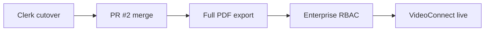

# BidIntelligenceOS — Phase 5 Roadmap

Deferred work extracted from [`PRODUCT_CONTRACT.md`](./PRODUCT_CONTRACT.md) and production alignment notes. Phase 4 (ops APIs, org profile partial enterprise fields, human-review export gates) is live on the team URL; this doc tracks what remains.

**Last updated:** 2026-07-08  
**Baseline:** `main` at **`bed6850`**+ (post-deploy smoke hook; leadership/export gates at `f8cd1f3`; Carmen checklist in alignment doc)  
**Team URL:** [https://bidintelligence.cagteam.net](https://bidintelligence.cagteam.net)

## Related docs

| Doc | Purpose |
|-----|---------|
| [`PRODUCT_CONTRACT.md`](./PRODUCT_CONTRACT.md) | Live vs demo module map; Phase 5 (deferred) table |
| [`ROSE_GITHUB_MAIN_ALIGNMENT.md`](./ROSE_GITHUB_MAIN_ALIGNMENT.md) | GitHub `main` alignment record (tip **`bed6850`**); Audit-Risk-Model PR #2 status; Carmen checklist (post-deploy smoke, export gate, this roadmap) |
| [`deploy/RUNBOOK.md`](../deploy/RUNBOOK.md) § **Post-deploy smoke** | `./deploy/deploy.sh` runs `scripts/smoke-team-url.mjs` when `BIOS_SMOKE_PASSWORD` is set |
| [`deploy/RUNBOOK.md`](../deploy/RUNBOOK.md) § **Clerk cutover checklist** | Step-by-step Clerk production cutover for `bidintelligence.cagteam.net` |

---

## Deferred items

### 1. Enterprise — white-label, multi-location, RBAC & invites

**Source:** [`PRODUCT_CONTRACT.md`](./PRODUCT_CONTRACT.md) § Phase 5 (deferred); Settings `/settings` enterprise tab.

| Surface | Current | Phase 5 target |
|---------|---------|----------------|
| White label | Prototype UI only | Brand color, product name override, custom domain, logo upload — persisted and applied across workspace + client exports |
| Multi-location | Prototype UI only | Franchise rollups, regional segmentation, location KPIs |
| RBAC & invites | Not built | Role templates, permission grants, user invites |
| `GET/PATCH /api/v1/org/profile` | **partial live** | Extend `organizations.profile_json` beyond `licenses`, `certifications`, `phone`, `contactEmail`, `leadership` |

**Routes:** `/settings` (Enterprise & White Label tab), `/business-profile` (reads persisted org fields).

**Acceptance:** Authed owners can configure branding and locations; invite users with scoped roles; business profile reflects saved enterprise data without demo fixtures.

---

### 2. VideoConnect live integration

**Source:** [`PRODUCT_CONTRACT.md`](./PRODUCT_CONTRACT.md) — Add-ons; `/video-connect` is **demo** (static marketing showcase, no live API).

| Current | Phase 5 target |
|---------|----------------|
| Static walkthrough cards for all sessions | Live capture/upload API, visual intelligence pipeline, walkthrough-to-bid draft linked to bid intake and Package Builder |
| Add-on marketplace entry only | Ops integration parallel to VoiceConnect pattern (honest empty / live data when signed in) |

**Route:** `/video-connect`

**Acceptance:** Signed-in users can record or upload site walkthroughs; detections feed ROSEOS scope analysis and optional package sections; demo fixtures remain for anonymous sessions only.

---

### 3. Full client export PDF pipeline

**Source:** [`PRODUCT_CONTRACT.md`](./PRODUCT_CONTRACT.md) — Package Builder; guardrails (`humanReviewed` required before client-facing use).

| Current | Phase 5 target |
|---------|----------------|
| Live section preview + compliance gates via `/api/v1/ops/package-builder` | Server-side PDF and DOCX generation from enabled package sections |
| Export buttons gated by `clientExportBlocked` (human review) but `handleExport` is toast-only | Downloadable client-facing artifacts; internal strategy/margin excluded per Package Builder copy |
| DOCX/PDF disabled until bid score human-reviewed (live authed) | Export unlocks after `humanReviewApproved` on bid detail (`PATCH /api/v1/bids/:id`) |

**Routes:** `/package-builder`, bid detail approve UX

**Acceptance:** After human review, authed users receive real PDF/DOCX files compiled from uploaded bid documents and compliance gates — not placeholder toasts.

---

### 4. Clerk production cutover

**Source:** [`ROSE_GITHUB_MAIN_ALIGNMENT.md`](./ROSE_GITHUB_MAIN_ALIGNMENT.md); [`deploy/RUNBOOK.md`](../deploy/RUNBOOK.md) § **Clerk cutover checklist — `bidintelligence.cagteam.net`**.

| Current | Phase 5 target |
|---------|----------------|
| Legacy smoke-test auth (`AUTH_ENABLED=false`) | `AUTH_ENABLED=true` with Clerk shared CCA auth |
| Email/password at `/login` | Clerk Sign in/up; legacy `POST /api/v1/auth/login` returns `400` when enabled |

**Checklist (summary — full steps in runbook):**

1. Preflight: `node scripts/clerk-cutover-preflight.mjs --check-only`
2. Server `.env` — Clerk keys, `VITE_CLERK_*`, `ADMIN_EMAILS` (never commit secrets)
3. Clerk Dashboard — allowed origins & redirect URLs for `bidintelligence.cagteam.net`
4. Deploy: `./deploy/deploy.sh` (rebuild required for `VITE_*`)
5. Verify health, Clerk UI at `/login`, user sync to local `users` / `organizations`
6. Decommission smoke-test users; rollback procedure documented in runbook if needed

**Do not** enable `AUTH_ENABLED=true` until redirect URLs are configured and deploy completes. See [`deploy/RUNBOOK.md`](../deploy/RUNBOOK.md) § Clerk cutover checklist.

---

### 5. Audit-Risk-Model PR #2 merge

**Source:** [`ROSE_GITHUB_MAIN_ALIGNMENT.md`](./ROSE_GITHUB_MAIN_ALIGNMENT.md) § Appendix — Audit-Risk-Model integration & merge status.

| Field | Value |
|-------|-------|
| PR | [#2 — feat: safe scoring-engine alignment (phase 1)](https://github.com/contractorcomplianceco-cmyk/Audit-Risk-Model/pull/2) |
| State | **OPEN** — awaiting Rose sign-off |
| Remote branch | `feat/safe-alignment-phase1` (tip `9e45521`) |
| CI | Green; mergeable |

**Scope:** Safe-alignment phase 1 — auth flag, model versioning, additive DB tables, shared BidOS score engine, audit API PM2 deploy stack.

**Live today (no BidOS code change required for compliance pull):** `AUDIT_ENGINE_API_URL` → local audit API; prod smoke `compliance-eligibility?state=FL` returns `auditCode: CCA-2026-BIOS-FL`.

**Acceptance:** Rose confirms merge to Audit-Risk-Model `main`; PM2 `cca-audit-api` tracks merged branch; BidOS continues compliance pull without regression.

**Blocker:** Do not merge without explicit Rose approval.

---

## Suggested sequencing

1. **Clerk cutover** — unblocks shared CCA identity for invites/RBAC work.
2. **Audit-Risk-Model PR #2** — locks scoring/compliance alignment before expanding client exports.
3. **Full client export PDF pipeline** — builds on existing human-review gates.
4. **Enterprise white-label / multi-location / RBAC** — depends on stable auth and org model.
5. **VideoConnect live** — add-on integration after core export and enterprise foundations.

Order may shift per product priority; items are independent enough to parallelize after Clerk + PR #2.

---

## Out of scope (Phase 5)

- VoiceConnect, BuildConnect, ComplianceConnect, CompetitorWatchOS live APIs (remain demo per contract)
- Orphan route promotion to nav (`/bid-library`, `/monitoring`, etc.)
- Briefing archive API

Update [`PRODUCT_CONTRACT.md`](./PRODUCT_CONTRACT.md) when any Phase 5 item ships.
