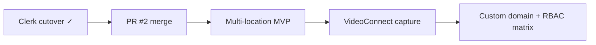

# BidIntelligenceOS — Phase 5 Roadmap

Deferred work extracted from [`PRODUCT_CONTRACT.md`](./PRODUCT_CONTRACT.md) and production alignment notes. Phase 4 (ops APIs, org profile partial enterprise fields, human-review export gates) is live on the team URL; this doc tracks what remains.

**Last updated:** 2026-07-09  
**Baseline:** `main` at **`7566d3c`**+ (white-label sidebar; VoiceConnect live bridge; RBAC invites; PDF/DOCX export; VideoConnect status bridge; Clerk cutover live)  
**Team URL:** [https://bidintelligence.cagteam.net](https://bidintelligence.cagteam.net)

## Related docs

| Doc | Purpose |
|-----|---------|
| [`PRODUCT_CONTRACT.md`](./PRODUCT_CONTRACT.md) | Live vs demo module map; Phase 5 (deferred) table |
| [`ROSE_GITHUB_MAIN_ALIGNMENT.md`](./ROSE_GITHUB_MAIN_ALIGNMENT.md) | GitHub `main` alignment record; Audit-Risk-Model PR #2 status; Carmen checklist |
| [`deploy/RUNBOOK.md`](../deploy/RUNBOOK.md) § **Post-deploy smoke** | `./deploy/deploy.sh` runs `scripts/smoke-team-url.mjs` when `BIOS_SMOKE_PASSWORD` is set |
| [`deploy/RUNBOOK.md`](../deploy/RUNBOOK.md) § **Clerk cutover checklist** | Clerk production cutover for `bidintelligence.cagteam.net` (**complete**) |

---

## Shipped in Phase 5 (2026-07)

| Item | Status | Notes |
|------|--------|-------|
| Clerk production cutover | **live** | `AUTH_ENABLED=true` on team URL; Sign in/up at `/login` |
| Full client export PDF/DOCX | **live** | Server-side generation after human review (`POST /api/v1/bids/:id/export`) |
| RBAC & invites | **partial live** | `POST/GET/DELETE /api/v1/org/invites`, accept flow, `GET /api/v1/org/members` join |
| White label | **partial live** | `brandName`, `productName`, `logoUrl`, `brandColor` persist; sidebar + business profile |
| VoiceConnect | **partial live** | Status + capture list via `VOICE_CONNECT_API_URL` |
| VideoConnect | **partial live** | Status + walkthrough list via `VIDEO_CONNECT_API_URL`; capture upload deferred |
| Briefing archive | **live** | `GET/POST /api/v1/briefings/archive` for authed users |
| Post-deploy smoke | **live** | Clerk-aware checks in `scripts/smoke-team-url.mjs` |

---

## Deferred items

### 1. Enterprise — multi-location, custom domain, permission matrix

**Source:** [`PRODUCT_CONTRACT.md`](./PRODUCT_CONTRACT.md) § Phase 5 (deferred); Settings `/settings` enterprise tab.

| Surface | Current | Phase 5 target |
|---------|---------|----------------|
| White label | **partial live** | `brandName`, `productName`, `logoUrl`, `brandColor` applied in sidebar + business profile; custom domain DNS/TLS deferred |
| Multi-location | planned → **in progress** | Franchise rollups, regional segmentation, location KPIs; minimal `locations[]` in `profile_json` shipping |
| RBAC & invites | **partial live** | Org invites + member list live; role templates and permission matrix UI remain demo |
| `GET/PATCH /api/v1/org/profile` | **partial live** | Enterprise fields + white-label + `locations` array |

**Routes:** `/settings` (Enterprise & White Label tab), `/business-profile` (reads persisted org fields).

**Acceptance:** Authed owners can configure branding and locations; invite users with scoped roles; business profile reflects saved enterprise data without demo fixtures.

---

### 2. VideoConnect full capture pipeline

**Source:** [`PRODUCT_CONTRACT.md`](./PRODUCT_CONTRACT.md) — Add-ons; `/video-connect` is **partial live**.

| Current | Phase 5 target |
|---------|----------------|
| **partial live** — status bridge + walkthrough proxy when `VIDEO_CONNECT_API_URL` set; `POST /api/walkthroughs` metadata stub on VideoConnect API | Full capture/upload pipeline, visual intelligence, walkthrough-to-bid draft linked to bid intake and Package Builder |
| Demo fixtures for anonymous | Ops integration parallel to VoiceConnect pattern (honest empty / live data when signed in) |

**Route:** `/video-connect`

**Acceptance:** Signed-in users can record or upload site walkthroughs; detections feed ROSEOS scope analysis and optional package sections; demo fixtures remain for anonymous sessions only.

---

### 3. Audit-Risk-Model PR #2 merge

**Source:** [`ROSE_GITHUB_MAIN_ALIGNMENT.md`](./ROSE_GITHUB_MAIN_ALIGNMENT.md) § Appendix — Audit-Risk-Model integration & merge status.

| Field | Value |
|-------|-------|
| PR | [#2 — feat: safe scoring-engine alignment (phase 1)](https://github.com/contractorcomplianceco-cmyk/Audit-Risk-Model/pull/2) |
| State | **OPEN** — awaiting Rose sign-off |
| Remote branch | `feat/safe-alignment-phase1` (tip `9e45521`) |
| CI | Green; mergeable |

**Scope:** Safe-alignment phase 1 — auth flag, model versioning, additive DB tables, shared BidOS score engine, audit API PM2 deploy stack.

**Live today (no BidOS code change required for compliance pull):** `AUDIT_ENGINE_API_URL` → local audit API; prod smoke `compliance-eligibility?state=FL` returns `auditCode: CCA-2026-BIOS-FL`.

**Acceptance:** Rose confirms merge to Audit-Risk-Model `main`; PM2 `cca-audit-api` tracks merged branch; BidOS continues compliance pull without regression.

**Blocker:** Do not merge without explicit Rose approval.

---

## Suggested sequencing

1. **Clerk cutover** — **complete** (2026-07).
2. **Audit-Risk-Model PR #2** — locks scoring/compliance alignment; awaiting Rose.
3. **Multi-location MVP** — `locations[]` in org profile + settings UI.
4. **VideoConnect full capture** — upload pipeline after metadata stub.
5. **Custom domain + permission matrix** — enterprise polish.

---

## Out of scope (Phase 5)

- BuildConnect, ComplianceConnect, CompetitorWatchOS live APIs (remain demo per contract)
- Orphan route promotion to nav (`/bid-library`, `/monitoring`, etc.) — bid-library and monitoring now in team nav

Update [`PRODUCT_CONTRACT.md`](./PRODUCT_CONTRACT.md) when any Phase 5 item ships.
